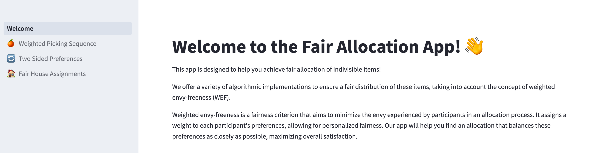

## Fair Allocation Application

Welcome to this Fair Allocation Web App. We have implemented three algorithms coming from papers ([1](https://arxiv.org/pdf/2112.04166.pdf),[2](https://arxiv.org/pdf/2206.05879.pdf),[3](https://www.sciencedirect.com/science/article/abs/pii/S0165489619300599)). The app is available at https://fair-alloc.streamlit.app/. 

The allocation app is designed to help you achieve some fairness notions by fairly allocating indivisible items. Here's how it works:

1. Start by providing the number of participants and the available items.
2. For each participant, specify their preferences for the items. You can assign weights to these preferences to reflect their importance.
3. Once you've entered all the preferences, click on the 'Run Allocation Algorithm' button.
4. Our algorithms will process the inputs and generate an allocation that minimizes envy while considering participant preferences.
5. The app will display the resulting allocation along with any relevant statistics or insights.

With our fair allocation app, you can explore various scenarios and experiment with different preferences and weightings to find an allocation that best satisfies the corresponding fairness and efficiency objective.