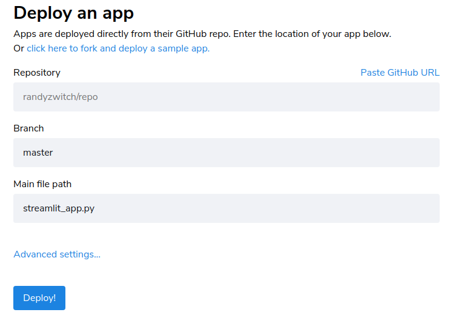

# Maintenance Guide

The app is developed in Python 3.11. The app interface is written with the help of [Streamlit framework](https://streamlit.io/).

## Setup Guide

The app is currently deployed on Streamlit cloud. Streamlit Cloud removes the complexities of managing servers and dependencies, allowing you to focus solely on building and refining your Streamlit apps. It seamlessly integrates with popular version control platforms like GitHub, enabling easy collaboration and continuous deployment workflows.

### Run locally

To run the app locally, you should have Python `>= 3.7` and pip installed on your machine.

Install the [requirements](./requirements.txt) file. Proceed to this folder and run:

```
python3 -m pip install -r requirements.txt
```

If there is any error regarding unsupported Streamlit versions. Please upgrade the Python version to 3.11.

Now run below commands to deploy the app on a local link.

```
cd ..
python3 -m streamlit run Welcome.py
```

If successful, you will see something similar to [this image](./deploy_info.png) where a Network URL is provided for you to browse the app.

If there is any error on finding `streamlit` in the environment, please refer to this [self-check guide](https://docs.streamlit.io/knowledge-base/using-streamlit/sanity-checks).

When you want to disconnect the app, just run `ctrl+c`.

### Run on Cloud

This app is currently running on my own Streamlit cloud account. If the account happens to be malfunctioning (which is rare), you should fork this repository to your account. Please follow [this link](https://github.com/JThh/fair-alloc-app-ra/fork) to fork it.

Now, you should open an account at Streamlit cloud with [this signup link](https://share.streamlit.io/signup), and choose `continue with GitHub`. Grant the access from GitHub to Streamlit Cloud before you [follow this guide](https://docs.streamlit.io/streamlit-community-cloud/get-started/deploy-an-app)(from `Deploy your app` onwards) to complete the deployment step. **Remember to choose the `new_main` branch and set the main file path as `Welcome.py`**. Set the custom domain as any link you would like.




## Algorithm Development Guide

There will be more and more new algorithms to come. We can extend the current app's functionality by adding new pages to the [pages folder](../pages/). 

For example, if we want to implement an algorithm for `multiwinner approval voting` based on this [paper](https://arxiv.org/pdf/2112.05994.pdf). We can name a new Python as `4_🗳️_Multiwinner_Approval_Voting.py` and append it to the previous three app files (at the time this guide was written). The contents of the file can be referred from the previous apps and the [Streamlit documentation](https://docs.streamlit.io/), except for the actual algorithm from the paper.


## Contigency Plans

There are a few exceptional cases where this app deployed at https://fair-alloc.streamlit.app/ can be down.  

1. The free quota for deploying public apps at Streamlit cloud has changed. In this case, we may need to check the new requirements and make adjustments to the account. This should not cause change to the source codes.
2. New Streamlit package verions are not backward-compatiable to part of current functionalities. For example, an API change in Streamlit input widgets such as `st.markdown` can cause an error in the app (like `use_unsafe_html` is no longer supported). It is therefore important to stick to the versions specified in the [requirements.txt](./requirements.txt) file.
3. The entire Streamlit Cloud is down. All apps will be affected. In this case, we have to turn to other private cloud providers such as [HuggingFace](https://huggingface.co/spaces/launch) and [Heroku](https://www.heroku.com/home). Note that upon transition of cloud services, the app URL will be altered. I have found [this guide](https://huggingface.co/spaces/facebook/MusicGen) regarding how to deploy Streamlit apps on Huggingface and Heroku informative. 